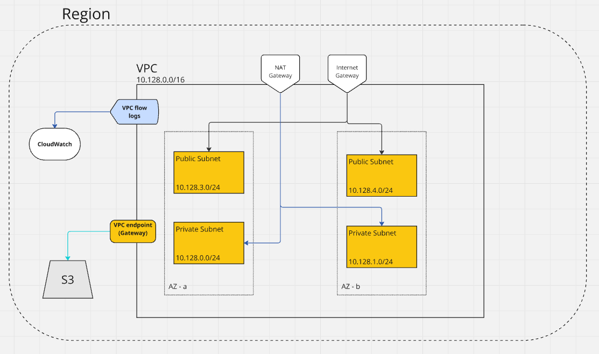

# Terraform Infra

terraform configuration to construct the infrastructure for all environments in different AWS accounts.

## Getting started

Before working with the repository it is **mandatory** to execute the following command:

```
pre-commit run -a
```

If you haven't installed pre-commit yet:

```
brew install pre-commit
pre-commit install
pre-commit run -a
```

## IP Ranges

We need to make sure we have a consistent approach for creating VPCs whereby the IP addresses never clash.

This is going to be required for VPC peering between VPCs to work successfully.

| Region    | Region Code    | CIDR block range | Platform            | IP addresses available |
|-----------|----------------|------------------|---------------------|------------------------|
| Ireland   | eu-west-1      | 10.62.0.0/16     | SAHA DEV            | 65,534                 |
| Ireland   | eu-west-1      | 10.64.0.0/18     | SAHA PROD           | 16,384                 |


## Running Terraform

To run the TF files you need to cd into each platform directory and run:

```
terraform init
terraform plan
terraform apply
```

## Basic architechture diagram


